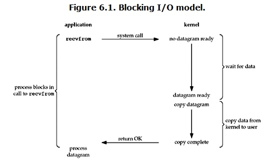

# I/O

## Blocking IO

## Non-blocking IO

## IO multiplexing

* read

* select

* poll

* epoll

* kqueue

## Signal driven IO

## Asynchronous I/O

***

# 参考

> [IO - 同步，异步，阻塞，非阻塞 （亡羊补牢篇）](http://blog.csdn.net/historyasamirror/article/details/5778378)

> [网络IO之阻塞、非阻塞、同步、异步总结](http://www.cnblogs.com/Anker/p/3254269.html)

> [使用异步 I/O 大大提高应用程序的性能](http://www.ibm.com/developerworks/cn/linux/l-async/)

> [也谈同步异步I/O](http://www.smithfox.com/?e=191)

> [深入浅出Node.js（五）：初探Node.js的异步I/O实现](http://www.infoq.com/cn/articles/nodejs-asynchronous-io)
